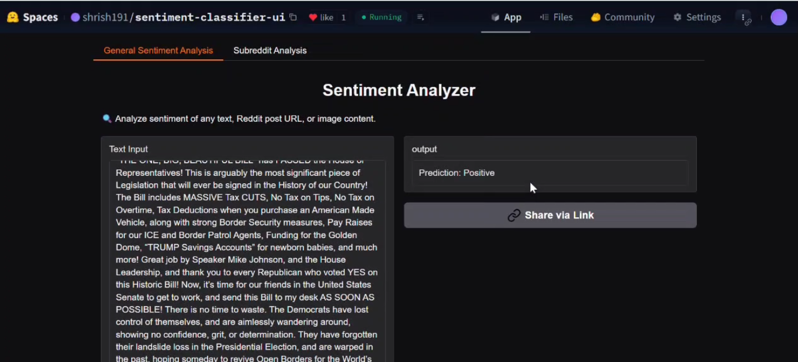
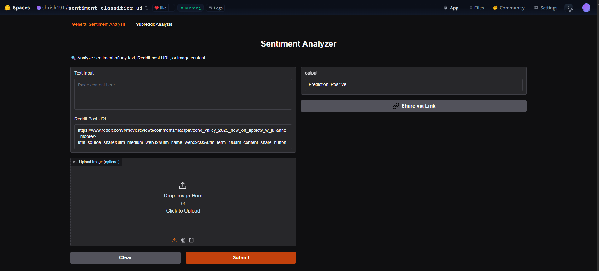
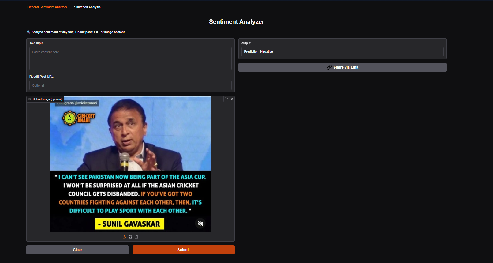
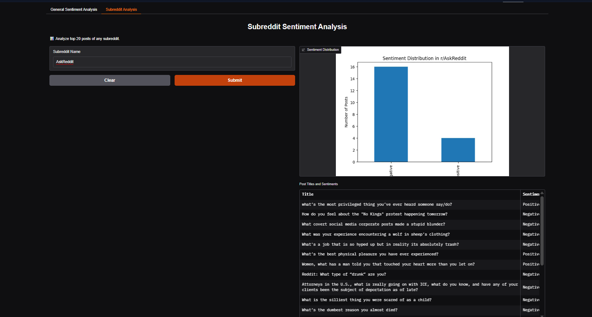

# 🧠 Multimodal Sentiment Analysis Web App  
A real-time BERT-powered sentiment analysis system that classifies social media text, Reddit posts, and even screenshots/memes into **Positive**, **Negative**, or **Neutral** sentiments.

---

## 🚀 Live Demo

👉 Try the app on Hugging Face Spaces:  
🔗 **[Sentiment Analyzer - Gradio Interface](https://huggingface.co/spaces/shrish191/sentiment-classifier-ui)**

---

## 📸 Screenshots

### 🔹 Text & Reddit Sentiment Analysis  

### 🔹 Image Upload with OCR  

### 🔹 Subreddit-Wide Sentiment Insights  

---

## 🧩 Features

- 🔍 **Multimodal Input Support**: Accepts plain text, Reddit post URLs, and images
- 🧠 **Transformer-based Prediction**: Fine-tuned BERT-base-uncased model
- 🧪 **Fallback Robustness**: RoBERTa used when primary model is uncertain
- 📷 **OCR Integration**: OpenCV + Tesseract to extract sentiment from screenshots/memes
- 📊 **Subreddit Trend Visualization**: Get bar chart + table of subreddit post sentiments
- 🌐 **Web-Based Interface**: Easy-to-use UI via Gradio

---

## 🛠️ Tech Stack

| Component      | Tool/Library                        |
|----------------|-------------------------------------|
| NLP Model      | 🤗 Transformers (BERT-base-uncased) |
| Fallback Model | RoBERTa (Cardiff NLP)               |
| Web UI         | Gradio                              |
| Image OCR      | OpenCV + Tesseract                  |
| Reddit API     | PRAW                                |
| Hosting        | Hugging Face Spaces                 |

---

## 📂 Project Structure
📁 sentiment-analyzer/
├── app.py # Main Gradio app
├── evaluate.py # Evaluation script for classification report
├── test.csv # Sample test set for metrics
├── requirements.txt # Dependencies
├── screenshots/ # Demo images
└── README.md # You are here!
